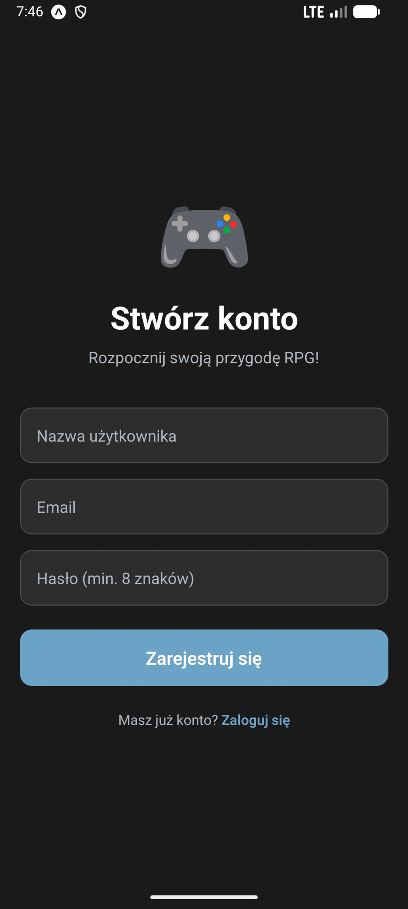
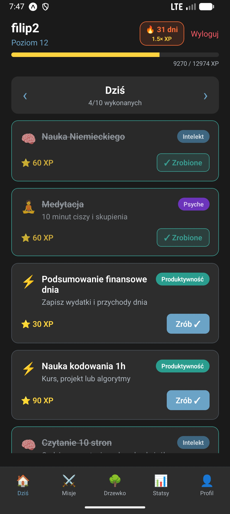
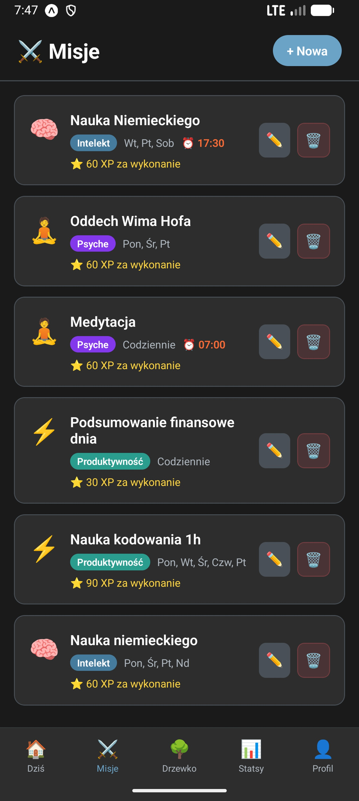
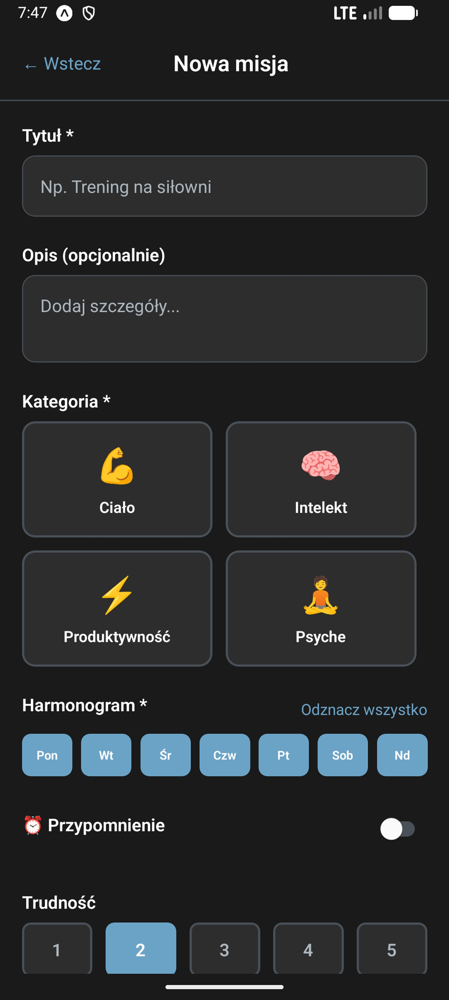
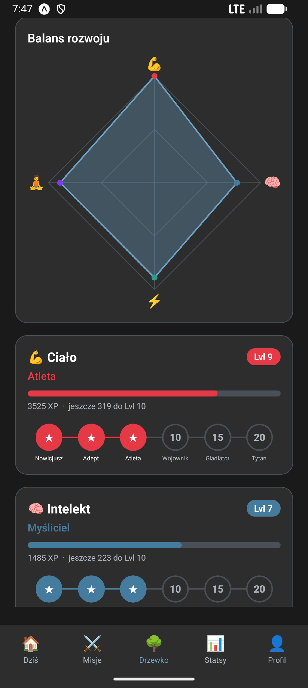
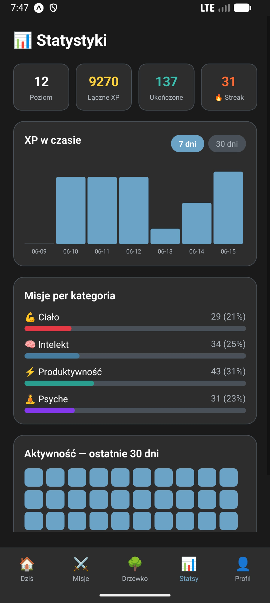
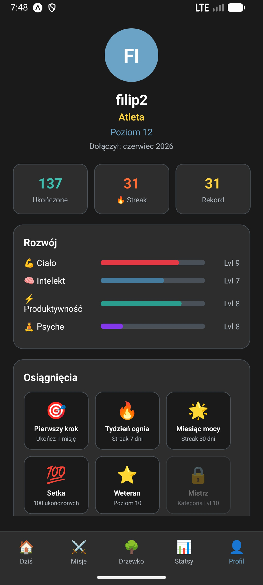

# LifeQuest

LifeQuest is a mobile app that turns your daily habits into an RPG game. You create "quests" (tasks you want to do regularly), complete them to earn XP, and watch your character grow across different life categories like fitness, learning, or productivity.

Built with React Native and Expo, so it runs on both Android and iOS.

## Demo

> [Watch the demo video](https://youtube.com/your-link-here)

## Screenshots

<p float="left">
  
  
  
  
  
  
  
</p>

## Features

- Register and log in with JWT authentication
- Create quests with a category, difficulty level, and weekly schedule (which days to show up)
- Complete quests to earn XP and level up
- Streak system: consecutive days of activity give a combo multiplier (up to 1.5x XP)
- Skill tree that grows separately per category
- Stats screen with charts and daily quest history
- Animated XP counter and level-up popup
- Push notification reminders (via Expo Notifications)

## Tech Stack

**Frontend**
- React Native 0.81 + Expo 54
- Redux Toolkit (state management)
- React Navigation (bottom tabs + stack)
- Axios (HTTP client)
- AsyncStorage (token storage)

**Backend**
- Node.js + Express 5
- MongoDB + Mongoose
- JWT authentication
- bcryptjs (password hashing)
- Helmet + CORS

## How to Run

You need Node.js 18+, npm, and either Expo Go on your phone or an Android/iOS emulator.

**1. Clone the repo**

```bash
git clone https://github.com/wojtas-it/life-quest.git
cd life-quest
```

**2. Set up the backend**

```bash
cd backend
cp .env.example .env
```

Open `.env` and fill in your MongoDB URI and a JWT secret:

```
MONGODB_URI=mongodb://localhost:27017/lifequest
JWT_SECRET=pick_something_long_and_random
```

Then:

```bash
npm install
npm run dev
```

The server starts on port 5000.

**3. Set up the frontend**

```bash
cd frontend
npm install
```

If you are running on a physical device (not an emulator), open `src/constants/config.js` and change the API URL to your machine's local IP address. On an emulator, `localhost` works fine.

```bash
npm start
```

Scan the QR code with Expo Go, or press `a` for Android emulator / `i` for iOS simulator.

**Optional: seed demo data**

```bash
cd backend
node src/seeders/categorySeed.js
```

## Project Structure

```
life-quest/
├── frontend/               # React Native app (Expo)
│   └── src/
│       ├── screens/        # App screens
│       ├── redux/          # State management
│       ├── services/       # API calls
│       ├── navigation/     # Navigation config
│       ├── constants/      # Config (API URL, XP values)
│       └── theme/          # Colors
│
├── backend/                # Express REST API
│   └── src/
│       ├── models/         # Mongoose schemas
│       ├── controllers/    # Route logic
│       ├── routes/         # API routes
│       ├── middleware/     # Auth middleware
│       ├── utils/          # Combo multiplier logic
│       └── seeders/        # Dev data scripts
│
├── docs/                   # Project documentation
└── screenshots/            # App screenshots for this README
```

## API Endpoints

| Method | Path | Description |
|--------|------|-------------|
| POST | `/api/auth/register` | Register new user |
| POST | `/api/auth/login` | Login |
| GET | `/api/auth/me` | Get current user |
| GET | `/api/quests` | List all quests |
| POST | `/api/quests` | Create quest |
| PUT | `/api/quests/:id` | Update quest |
| PATCH | `/api/quests/:id/complete` | Complete quest (awards XP) |
| DELETE | `/api/quests/:id` | Delete quest |
| GET | `/api/stats` | Get activity stats |
| GET | `/api/skilltree` | Get skill tree progress |
| GET | `/api/questlog` | Get quest log by date |

## Project Status

The core features are working end to end. This was developed as a university project and is being polished for portfolio use.

What works:
- Authentication (register, login, JWT)
- Quest CRUD with scheduling
- XP system, leveling, streak and combo
- Skill tree, stats, profile with achievements
- Push notification scheduling

What is still rough:
- No frontend input validation beyond basic required-field checks
- Production deployment not configured
- No tests

## License

MIT
